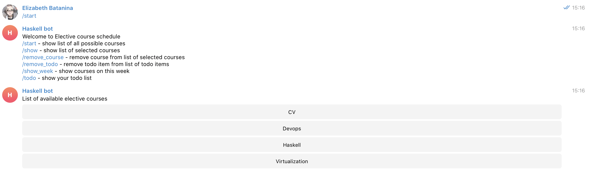
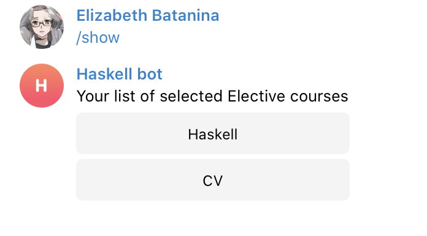
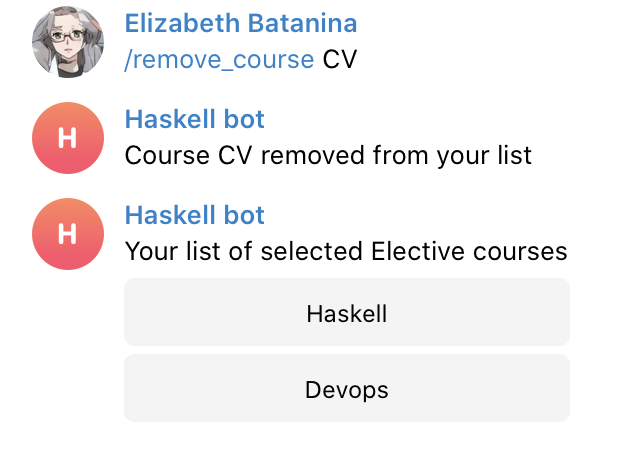
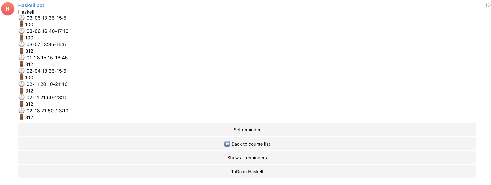
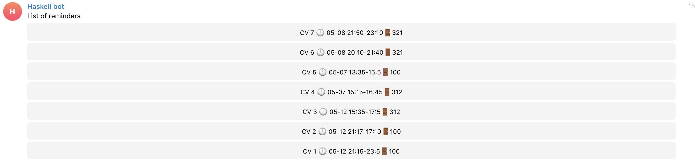
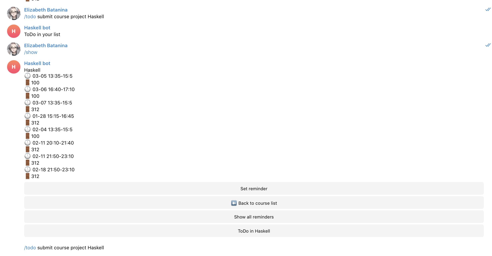

# IU Elective course Telegram Bot

Telegram bot for scheduling elective courses in  Innopolis University. 

## Features:

This bot helps you to not forget time and palce of your elective lectures, by aggregating all elective courses 
schedule from official elective courses source in Innopolis University. 

## What you can do with this bot?

1. Add available courses to your base (bot will remember what courses you have chosen)
2. Can see full schedule of your courses: lectures time and place
3. Set reminder on specific course - our bot will send you message that you have lecture now
4. Add todos messages to course

## Pipeline:

1. Start screen: 



2. Add courses and list your  courses 


3. Remove courses


4. Show course content

Course has: list of lectures with rooms by default, you can set reminders on this course and add todos.


5. You can also check what reminders you have


6. Receive message-reminder about starting lecture


7. Add TODOs to your course about future tasks or deadlines


## How to build and run

Build project

```
stack build
```

Run project

```
stack run
```
Enter telegram bot token
```
<bot-token>
```

### Authors

Kamilya Timchenko

Elizabeth Batanina

Anton Timchenko

Nariman Daniyar

### Future work 

Add DataBase 